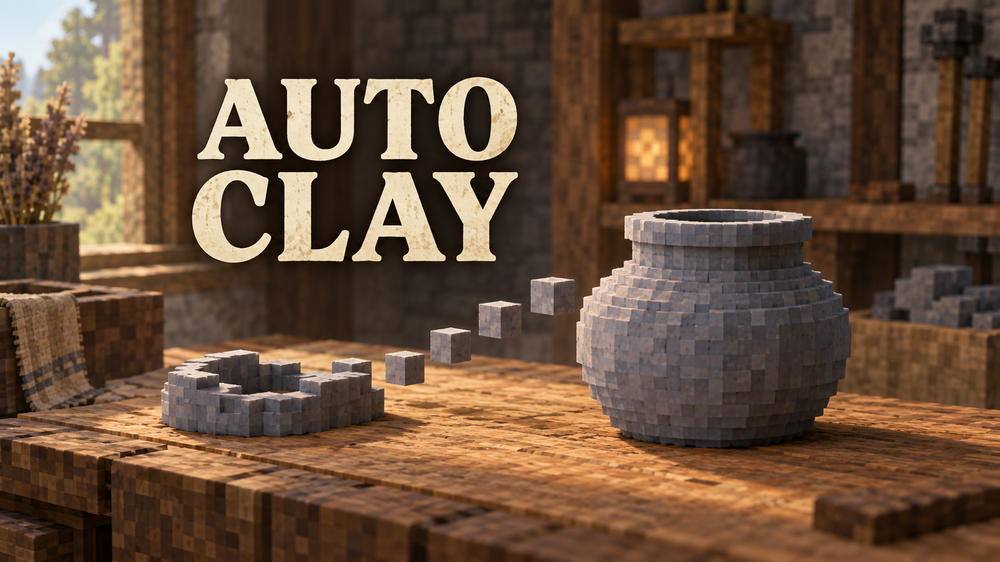

# Auto Clay



Client-Mod für **Vintage Story 1.22.7**. Clay-Modelle automatisch fertigstellen, solange die rechte Maustaste gedrückt bleibt. Die Kamera bleibt dabei in der Blickrichtung vom Start fixiert.

## Installation und Bedienung

1. `Releases/vsautoclay_0.1.0.zip` unverändert in den clientseitigen `VintagestoryData/Mods`-Ordner kopieren und das Spiel neu starten. Beim Umstieg die bisherige `autoclay_0.1.0.zip` dieser Mod entfernen.
2. Ton platzieren und das gewünschte Rezept auswählen.
3. Passenden Ton in der Hand halten, das Werkstück anvisieren und **F → Automatisch formen** auswählen. Der Eintrag hat ein **A** als Symbol.
4. **Rechtsklick gedrückt halten.** Loslassen pausiert und gibt die Kamera frei. Erneutes Gedrückthalten setzt die Form fort.

Auf dieser Linux-Installation liegt der Mods-Ordner unter `~/.config/VintagestoryData/Mods`.

Es werden keine zusätzlichen Mods benötigt. `survival` in den Metadaten bezeichnet den mit dem Spiel gelieferten Survival-Spielinhalt. Harmony und die weiteren verwendeten Bibliotheken liefert ebenfalls das Spiel. Auf dem Server wird nichts installiert.

## Verhalten

- Arbeitet das ausgewählte Rezept von unten nach oben ab und korrigiert überflüssige Tonwürfel.
- Nutzt passende 1×1-, 2×2- und 3×3-Pinsel sowie das normale Kopieren von bis zu vier Würfeln aus der vorherigen Schicht.
- Verbraucht Ton über die normale Spielmechanik, einschließlich der zugehörigen Server-Interaktion. Vorhandene Tonwürfel werden wiederverwendet.
- Sendet begrenzte Aktionsgruppen und wartet auf den passenden Serverstand. Das Tempo hängt von Rezept, Rechner und Server ab.
- Stoppt bei Loslassen, geöffneten Dialogen, Fokusverlust, Slotwechsel, fehlendem Ton, fehlenden Nutzungsrechten, zu großer Entfernung und Fertigstellung. Nach einem Stopp muss Rechtsklick neu gedrückt werden.
- Nach Fertigstellung bleibt die laufende Maustastenbetätigung abgefangen, damit kein weiteres Werkstück angelegt oder das Ergebnis versehentlich benutzt wird.
- Bereits gesendete Aktionen können nach dem Loslassen noch abgeschlossen werden.
- Wenn das letzte gehaltene Tonstück zum Nachlegen verbraucht wird, pausiert die Mod. Weiteren passenden Ton in die Hand nehmen und erneut starten.
- Die normalen Werkzeugmodi im F-Menü schalten die Automatik aus. Der Automatikmodus wird beim Verlassen der Welt zurückgesetzt.

Die Mod verwendet das normale Clayforming-System. Mod-Rezepte mit demselben System sind grundsätzlich nutzbar; Änderungen anderer Mods an Formaktionen sind nicht geprüft. Andere Spielversionen werden zur Laufzeit abgewiesen.

## Einstellungen

Nach dem ersten Laden entsteht `VintagestoryData/ModConfig/vsautoclay.json`:

```json
{
  "ActionsPerBatch": 32,
  "ServerTimeoutMilliseconds": 5000
}
```

`ActionsPerBatch` liegt zwischen 1 und 64. Eine Gruppe wird außerdem nach ungefähr 6 ms Rechenzeit beendet; eine einzelne Aktion kann dieses Zeitbudget überschreiten. Bei Ton-Nachschub endet die Gruppe sofort. `ServerTimeoutMilliseconds` liegt zwischen 1000 und 30000. Änderungen werden nach dem erneuten Laden übernommen.

## Bauen

Das Projekt wurde mit dem offiziellen `VintageStory.Mod.Templates` **1.22.0** angelegt und verwendet dessen Cake-Build-Ansatz. Der eingebaute ModMaker kann die benötigte C#-Interaktionslogik nicht erstellen.

Voraussetzungen: **.NET SDK 10.0.401** und eine lokale Installation von **VS 1.22.7**. Spielbibliotheken sind nicht im Repository oder im Mod-Paket enthalten.

Linux/macOS:

```bash
export VINTAGE_STORY=/pfad/zur/vintagestory-installation
./build.sh
```

Unter Linux wird `/opt/vintagestory` automatisch erkannt. Das Build-Skript verwendet das lokale SDK unter `.tools/dotnet`, sofern vorhanden.

Windows PowerShell:

```powershell
$env:VINTAGE_STORY = 'C:\Pfad\zu\Vintagestory'
./build.ps1
```

Ergebnis: `Releases/vsautoclay_0.1.0.zip`. Die ZIP enthält ausschließlich `AutoClay.dll`, `modinfo.json` und Sprachdateien. Build- und Testpakete werden nicht ausgeliefert.

## GitHub-Releases

1. Die neue Version im Format `X.Y.Z` in `AutoClay/modinfo.json` und `AutoClay/AutoClay.csproj` eintragen und den geprüften Änderungs-PR nach `main` mergen.
2. Einen annotierten, signierten Tag auf diesem Commit erstellen und pushen, beispielsweise für die bestehende Version:

   ```bash
   git fetch origin
   git tag -s v0.1.0 origin/main -m 'Auto Clay 0.1.0'
   git verify-tag v0.1.0
   git push origin refs/tags/v0.1.0
   ```

3. Der Workflow **Verify** baut und prüft den getaggten Stand mit VS 1.22.7, einschließlich Tests, Abdeckung, Abhängigkeitsprüfung, Secret-Scan und CodeQL. Erst nach Erfolg veröffentlicht **Release** die Datei `vsautoclay_X.Y.Z.zip` und `SHA256SUMS` mit automatisch erzeugten Release Notes.

Die Tag-Signatur muss zum öffentlichen SSH-Schlüssel in `.github/release-signers` passen. Der private Schlüssel bleibt lokal. Der Tag muss auf einen Commit in der geschützten `main`-Historie zeigen; Tag, Projektversion und Mod-Metadaten müssen übereinstimmen. Die Veröffentlichung verwendet die Workflow- und Schlüsselregeln von `main` und das bereits geprüfte Build-Artefakt. Nur der letzte Veröffentlichungsschritt erhält Schreibrechte.

Unter **Actions → Release → Run workflow** auf Branch **main** ist ein manueller Prüflauf möglich: `dry_run` eingeschaltet lassen und das Tag-Feld leer lassen, um das letzte erfolgreiche Build für den aktuellen `main`-Commit einschließlich ZIP und Prüfsumme zu prüfen. Mit eingetragenem Tag wird zusätzlich dessen Signatur geprüft. Der Prüflauf veröffentlicht nichts.

Bei einem fehlgeschlagenen Release-Lauf kann derselbe Tag dort mit ausgeschaltetem `dry_run` erneut veröffentlicht werden. Vorher muss ein erfolgreicher **Verify**-Lauf für den Tag vorhanden sein. Build-Artefakte bleiben 14 Tage verfügbar; bei Ablauf **Verify** für den Tag erneut starten. Bereits veröffentlichte Releases werden nicht überschrieben. Bestehende Versions-Tags dürfen weder verschoben noch gelöscht werden; Korrekturen erhalten eine neue Version.

Die Pipeline veröffentlicht auf GitHub. Das Hochladen auf die Vintage-Story-ModDB erfolgt weiterhin manuell.

## Prüfung

```bash
dotnet format AutoClay.sln --verify-no-changes
dotnet test AutoClay.Tests/AutoClay.Tests.csproj -c Release
dotnet list AutoClay.sln package --vulnerable --include-transitive
```

Die 63 Tests verwenden die echte VS-Assembly für Formpinsel, Rezeptumwandlung und Tonverbrauch. Sie prüfen sämtliche 31 mitgelieferten Clay-Rezeptdateien sowie Reparaturen, Synchronisationszustände, Menüauswahl und Abbruchbedingungen. Es gibt keine gesonderten Testskripte.

Gemessene Abdeckung: 92,76 % der Zeilen und 82,67 % der Verzweigungen. `dotnet test` erzwingt getrennte Mindestwerte von 90 % beziehungsweise 80 %. Die Formlogik ist vollständig zeilenabgedeckt. Grafik, Netzzustellung und der vollständige Spielablauf werden durch diese Abdeckung nicht bestätigt.

Der vollständige Spieltest von F-Menü, Kameraverhalten und Multiplayer steht noch aus: Das separate Testprofil konnte ohne Anmeldung keine Welt öffnen. Die automatisierten Tests ersetzen diesen Spieltest nicht.
